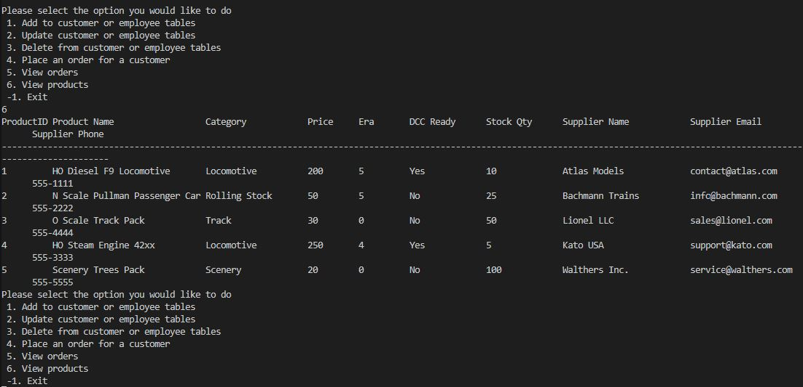
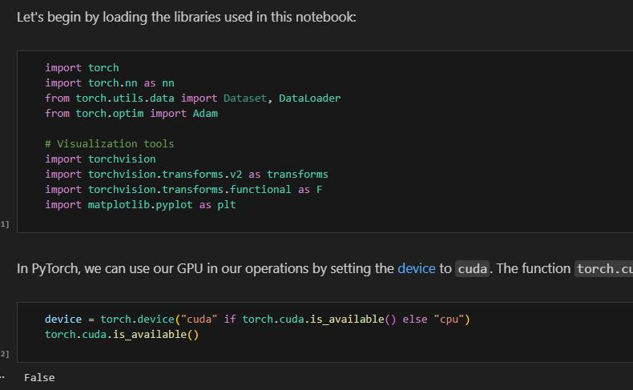

<html>
<head>
    <meta charset="UTF-8">
    <title>Brandon F | Projects</title>
    <meta name="description" content="Software development projects completed by Brandon F.">
    <meta name="viewport" content="width=device-width, initial-scale=1.0">
    <link rel="stylesheet" href="../styles.css">
</head>

<body>

<nav>
    <a href="../index.html">Home</a>
    <a href="AboutMe.html">About</a>
    <a href="experience.html">Experience</a>
    <a href="hobbies.html">Hobbies</a>
    <a href="projects.html">Projects</a>
</nav>

    <h1>Projects</h1>
    

        Visit my 
        <a href="https://github.com/percy617" target="_blank">
            GitHub profile
        </a>
        to see additional repositories.
    

    

        

            <h3>Managing Databases Using SQL</h3>
            
This project involved building a C++ interface for managing a fictional SQL database system.

            

                <a href="https://github.com/CSCI210-FW/fa25-m08-final-project-percy617" target="_blank">
                    View Project Repository
                </a>
            

        

        

            
        

    

    

        

            <h3>Documenting JupyterLab Notebooks</h3>
            
This project required configuring and documenting NVIDIA JupyterLab notebooks.

            

                <a href="https://docs.google.com/document/d/1ZuhEgHMvA_3aXeVpR_dH99kF3YlMi3PowN_Jxn8o048/edit" target="_blank">
                    View Documentation
                </a>
            

        

        

            
        

    

<footer>
    © 2026 Brandon F | Personal Portfolio Website
</footer>

</body>
</html>
